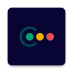

# AndroidCoviLights    
CoviLights Android Application

Link to UI/UX design and assets:
https://www.figma.com/file/Ij9ViaAUBnmmsidQourBsC/COVID

## CoviLights
CoviLights is a project to create a GDPR compliant contact tracing app for Covid-19 contact tracing purposes. 

## Motivation
When the peak of COVID-19 cases is overcome, effective contact tracing is thought to be an important element of maintaining infections at a low level. By providing effective contact tracing, smartphone apps can be part of exit strategies.

Since COVID-19 does not stop at borders, we believe such contact tracing should be a truly open, global project. But since many users will be based in the EU, we also want to make it GDPR compliant, and offer that data protection "gold standard" to all users. 

## Documentation
See our Wiki for project documentation:
https://github.com/covilights/Documentation/wiki

## License 

Copyright 2020 CoviLights GbR

Licensed under the Apache License, Version 2.0 (the "License");
you may not use this file except in compliance with the License.
You may obtain a copy of the License at

   http://www.apache.org/licenses/LICENSE-2.0

Unless required by applicable law or agreed to in writing, software
distributed under the License is distributed on an "AS IS" BASIS,
WITHOUT WARRANTIES OR CONDITIONS OF ANY KIND, either express or implied.
See the License for the specific language governing permissions and
limitations under the License.
